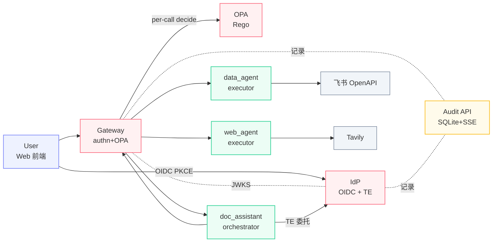
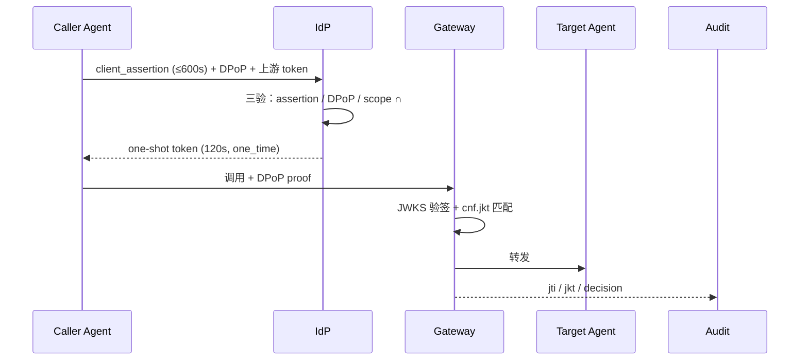

<!-- P1 · 封面 · § 一、 -->

<div class="absolute top-4 right-6 text-xs text-gray-400">§ 一、</div>

<div class="text-center mt-12">

# A2A-Token-System

<div class="text-2xl text-gray-600 mt-4 mb-12">面向多 Agent 协作的零信任授权平台</div>

<div class="grid grid-cols-3 gap-4 max-w-2xl mx-auto mb-8">
  <div class="p-3 rounded border border-blue-200 bg-blue-50">
    <div class="font-bold text-base">陈奕燔</div>
    <div class="text-xs text-gray-500">组长 · IdP / OPA</div>
  </div>
  <div class="p-3 rounded border border-blue-200 bg-blue-50">
    <div class="font-bold text-base">周展鹏</div>
    <div class="text-xs text-gray-500">Gateway / Web / Audit</div>
  </div>
  <div class="p-3 rounded border border-blue-200 bg-blue-50">
    <div class="font-bold text-base">金梓墨</div>
    <div class="text-xs text-gray-500">Agents / SDK / 飞书</div>
  </div>
</div>

<div class="text-sm text-gray-500">杭州电子科技大学 · 飞书 AI 校园挑战赛 决赛 2026</div>
<div class="text-xs text-gray-400 mt-2">github.com/your-org/A2A-Token-System</div>

</div>

<!--
开场 15s：
- 项目名 · 一句副标点出"零信任 + 多 Agent + 授权"
- 三人分工先快速亮一下
- 然后翻页进入项目结果
-->

---

<!-- P2 · 核心代码模块速览 · § 二-1-1) -->

<div class="absolute top-4 right-6 text-xs text-gray-400">§ 二-1-1)</div>

# 核心代码模块速览

<div class="grid grid-cols-4 gap-3 mt-6 text-sm">

<div class="p-3 rounded border border-rose-200 bg-rose-50">
  <div class="font-bold">IdP</div>
  <div class="text-xs text-gray-500 font-mono">/token/exchange</div>
  <div class="text-xs mt-1">三验签发委托 token · 按需最小权限</div>
</div>

<div class="p-3 rounded border border-rose-200 bg-rose-50">
  <div class="font-bold">Gateway</div>
  <div class="text-xs text-gray-500 font-mono">authn_middleware</div>
  <div class="text-xs mt-1">唯一入口 JWKS 验签 + per-call OPA 复核</div>
</div>

<div class="p-3 rounded border border-rose-200 bg-rose-50">
  <div class="font-bold">OPA</div>
  <div class="text-xs text-gray-500 font-mono">agent.authz / a2a.rego</div>
  <div class="text-xs mt-1">Rego 10 条全 AND · 决策与代码解耦</div>
</div>

<div class="p-3 rounded border border-amber-200 bg-amber-50">
  <div class="font-bold">Audit API</div>
  <div class="text-xs text-gray-500 font-mono">BatchWriter</div>
  <div class="text-xs mt-1">asyncio.Queue → SQLite 批写 + SSE 广播</div>
</div>

<div class="p-3 rounded border border-emerald-200 bg-emerald-50">
  <div class="font-bold">SDK</div>
  <div class="text-xs text-gray-500 font-mono">client.invoke</div>
  <div class="text-xs mt-1">屏蔽 DPoP + TE · 三框架 adapter</div>
</div>

<div class="p-3 rounded border border-emerald-200 bg-emerald-50">
  <div class="font-bold">doc_assistant</div>
  <div class="text-xs text-gray-500 font-mono">dispatcher._topo_layers</div>
  <div class="text-xs mt-1">LangGraph DAG 拓扑分层并发执行</div>
</div>

<div class="p-3 rounded border border-sky-200 bg-sky-50">
  <div class="font-bold">data_agent / web_agent</div>
  <div class="text-xs text-gray-500 font-mono">tool dispatcher</div>
  <div class="text-xs mt-1">飞书 OpenAPI + Tavily 检索</div>
</div>

<div class="p-3 rounded border border-indigo-200 bg-indigo-50">
  <div class="font-bold">Web 前端</div>
  <div class="text-xs text-gray-500 font-mono">OIDC PKCE</div>
  <div class="text-xs mt-1">RFC 7636 抗授权码截获</div>
</div>

</div>

<div class="text-center text-sm text-gray-500 mt-6">
下一页看 7 模块如何协同 →
</div>

<!--
P2 35s：
- 横扫 7 模块，让评委建立"这是 7 个独立组件的协作"心智
- 配色：红=安全核心、橙=审计、绿=AI编排、蓝=业务Agent、紫=用户前端
- 这套配色 P3 架构图节点继承
- 结束句引向 P3
-->

---

<!-- P3 · 系统架构 · § 二-1-2) 设计 -->

<div class="absolute top-4 right-6 text-xs text-gray-400">§ 二-1-2)</div>

# 系统架构



<div class="text-xs text-gray-500 text-center mt-4">
标准协议栈（OIDC + Token Exchange + DPoP）· 职责严格分离（orchestrator / executor 互斥）
</div>

<!--
P3 50s：
- 节点配色与 P2 模块卡片对齐
- 强调三条主线：用户登录、Agent 间委托（TE）、per-call 鉴权
- 引出下一页"三步走"展开数据流
-->

---

<!-- P4 · 系统功能简述 · § 二-1-2) 简述 -->

<div class="absolute top-4 right-6 text-xs text-gray-400">§ 二-1-2)</div>

# 系统功能简述

<div class="grid grid-cols-3 gap-5 mt-6">

<div class="p-4 rounded-lg border-2 border-indigo-200 bg-indigo-50">
  <div class="text-3xl mb-1">①</div>
  <div class="font-bold text-base mb-2">用户登录</div>
  <div class="text-xs text-gray-700 leading-relaxed">
    OIDC + PKCE（RFC 7636）<br/>
    抗授权码截获<br/>
    一次性 code → access_token
  </div>
</div>

<div class="p-4 rounded-lg border-2 border-rose-200 bg-rose-50">
  <div class="text-3xl mb-1">②</div>
  <div class="font-bold text-base mb-2">Token Exchange</div>
  <div class="text-xs text-gray-700 leading-relaxed">
    RFC 8693 委托链<br/>
    客户端 assertion + DPoP + 上游 token<br/>
    <b>120s 一次性</b> · <code>one_time</code> 强制
  </div>
</div>

<div class="p-4 rounded-lg border-2 border-emerald-200 bg-emerald-50">
  <div class="text-3xl mb-1">③</div>
  <div class="font-bold text-base mb-2">执行鉴权</div>
  <div class="text-xs text-gray-700 leading-relaxed">
    Gateway 验签 + per-call OPA<br/>
    Rego 全 AND 决策<br/>
    Audit 全程记录
  </div>
</div>

</div>

<div class="mt-8 p-3 rounded bg-amber-50 border border-amber-200 text-sm text-center">
🔒 <b>AI 链路</b>（编排 / 调用 / 输出）与 <b>安全链路</b>（IdP / GW / OPA）<b>严格隔离</b> — AI 故障不污染授权决策
</div>

<!--
P4 45s：
- 用三栏对照 P3 三条主线，落到"做什么"
- 强调 ② 的 120s 一次性是核心创新点之一
- 底部隔离提示是技术亮点 — 为 P8 铺垫
-->

---

<!-- P5 · Agents 实现 · § 二-1-2) 补充 -->

<div class="absolute top-4 right-6 text-xs text-gray-400">§ 二-1-2)</div>

# Agents 实现：编排者 + 执行者

<div class="grid grid-cols-3 gap-3 mt-4 text-xs">

<div class="p-3 rounded-lg border-2 border-emerald-200 bg-emerald-50">
  <div class="font-bold text-sm mb-1">doc_assistant</div>
  <div class="text-emerald-700 mb-2"><b>orchestrator</b></div>
  <div class="space-y-1 text-gray-700">
    <div>• LangGraph DAG 编排</div>
    <div>• <code>planner</code>：LLM JSON mode + 规则回退</div>
    <div>• <code>_topo_layers</code> 拓扑分层</div>
    <div>• <code>asyncio.gather</code> 同层并发</div>
    <div>• <code>validate_dag()</code> 失败重试</div>
  </div>
</div>

<div class="p-3 rounded-lg border-2 border-sky-200 bg-sky-50">
  <div class="font-bold text-sm mb-1">data_agent</div>
  <div class="text-sky-700 mb-2"><b>executor</b></div>
  <div class="space-y-1 text-gray-700">
    <div>• Intent 路由（regex 匹配）</div>
    <div>• 飞书 OpenAPI：bitable / docx / contact / calendar / drive</div>
    <div>• Prompt Injection 清洗</div>
    <div>• 无 LLM · 纯确定性</div>
  </div>
</div>

<div class="p-3 rounded-lg border-2 border-sky-200 bg-sky-50">
  <div class="font-bold text-sm mb-1">web_agent</div>
  <div class="text-sky-700 mb-2"><b>executor</b></div>
  <div class="space-y-1 text-gray-700">
    <div>• <code>web.search</code> · Tavily 检索</div>
    <div>• <code>web.fetch</code> · HTML 提取 + LLM 摘要</div>
    <div>• URL allowlist 限制</div>
    <div>• 速率限制 + 安全提取</div>
  </div>
</div>

</div>

<div class="mt-4 p-3 rounded bg-indigo-50 border border-indigo-200 text-xs">
  <div class="font-bold text-sm mb-2">共享基础设施</div>
  <div class="grid grid-cols-2 gap-2 text-gray-700">
    <div>• <b>SDK</b>：屏蔽 RFC 8693 TE + RFC 9449 DPoP + W3C traceparent</div>
    <div>• <b>AgentServer</b> 基类 · <code>capability.find()</code> 调用前匹配</div>
    <div>• <code>@field_validator("role")</code> 强制 orchestrator / executor 互斥</div>
    <div>• 三框架 adapter：LangChain · LangGraph · AutoGen</div>
  </div>
</div>

<!--
P5 Agents 实现 35s：
- 一句一句过：doc_assistant 编排 / 两个 executor 执行
- 重点：role 互斥是 SoD（职责分离）落地
- adapter 三选一对应三种主流多 Agent 框架
- 时长压缩：可秒过共享栏，重点在三卡
-->

---

<!-- P5 · 项目亮点 ① 协议栈 + 零信任 A2A · § 二-1-3) -->

<div class="absolute top-4 right-6 text-xs text-gray-400">§ 二-1-3) ①</div>

# 亮点 ①：标准协议栈 + 零信任 A2A

<div class="grid grid-cols-6 gap-2 mb-4 text-xs">
  <div class="p-2 rounded border border-gray-300 bg-white text-center">
    <div class="font-bold">RFC 7519</div><div class="text-gray-500">JWT</div>
  </div>
  <div class="p-2 rounded border border-gray-300 bg-white text-center">
    <div class="font-bold">RFC 7523</div><div class="text-gray-500">Client Assertion</div>
  </div>
  <div class="p-2 rounded border border-gray-300 bg-white text-center">
    <div class="font-bold">RFC 7636</div><div class="text-gray-500">PKCE</div>
  </div>
  <div class="p-2 rounded border border-gray-300 bg-white text-center">
    <div class="font-bold">RFC 7638</div><div class="text-gray-500">JWK Thumbprint</div>
  </div>
  <div class="p-2 rounded border-2 border-rose-400 bg-rose-50 text-center">
    <div class="font-bold">RFC 8693</div><div class="text-rose-600">Token Exchange ★</div>
  </div>
  <div class="p-2 rounded border-2 border-rose-400 bg-rose-50 text-center">
    <div class="font-bold">RFC 9449</div><div class="text-rose-600">DPoP ★</div>
  </div>
</div>



<div class="grid grid-cols-3 gap-3 mt-2 text-xs">
  <div class="p-2 rounded bg-blue-50 border border-blue-200">
    <b>assertion</b> 证身份
  </div>
  <div class="p-2 rounded bg-blue-50 border border-blue-200">
    <b>one-shot token</b> 防重放
  </div>
  <div class="p-2 rounded bg-blue-50 border border-blue-200">
    <b>DPoP</b> 防盗用
  </div>
</div>

<!--
P5 55s：
- 6 RFC 不念，扫一眼即可。重点钉两颗星：8693 与 9449
- sequence 图主讲：IdP 三验 + Gateway cnf.jkt 复验
- 时序图证明：标准协议栈，复用 IETF，没有自创轮子
-->

---

<!-- P6 · 亮点 ② 最小权限 + 三道关 · § 二-1-3) -->

<div class="absolute top-4 right-6 text-xs text-gray-400">§ 二-1-3) ②</div>

# 亮点 ②：最小权限 + 三道关

<div class="grid grid-cols-2 gap-6 mt-4">

<div>
  <div class="text-sm font-bold mb-2 text-gray-700">最小权限计算</div>
  <div class="p-4 rounded-lg bg-gradient-to-br from-purple-50 to-blue-50 border-2 border-purple-200">
    <div class="font-mono text-sm text-center my-2 leading-relaxed">
      <span class="text-purple-700">effective_scope</span> =<br/>
      <span class="text-rose-600">callee_caps</span> ∩<br/>
      <span class="text-emerald-600">user_perms</span> ∩<br/>
      <span class="text-amber-600">requested_scope</span>
    </div>
  </div>
  <div class="text-xs mt-3 space-y-1">
    <div>• <b>callee_caps</b>：被调端能力上限（注册时声明）</div>
    <div>• <b>user_perms</b>：用户授权范围（OIDC consent）</div>
    <div>• <b>requested_scope</b>：本次任务真正需要</div>
  </div>
  <div class="text-xs mt-3 p-2 bg-amber-50 rounded">三者全空 ⇒ 拒签 · 永不"宽给"</div>
</div>

<div>
  <div class="text-sm font-bold mb-2 text-gray-700">三道关防御</div>
  <div class="space-y-2">
    <div class="p-3 rounded border-l-4 border-rose-400 bg-rose-50">
      <div class="font-bold text-sm">① IdP 签发关</div>
      <div class="text-xs text-gray-600">事前 ABAC：subject / agent / action / context</div>
    </div>
    <div class="p-3 rounded border-l-4 border-orange-400 bg-orange-50">
      <div class="font-bold text-sm">② Gateway × OPA 关</div>
      <div class="text-xs text-gray-600">per-call Rego 10 条全 AND 复核</div>
    </div>
    <div class="p-3 rounded border-l-4 border-amber-400 bg-amber-50">
      <div class="font-bold text-sm">③ Capability 匹配关</div>
      <div class="text-xs text-gray-600">启动期注册声明 + 调用前 <code>capability.find()</code> 二次校验</div>
    </div>
  </div>
</div>

</div>

<!--
P6 55s：
- 公式是"创新性"的钉子 — 三集合交集
- 三道关展示"纵深防御"，回应技术深度评分
- 注意：与 P5 是不同视觉布局（公式 vs 横向卡）避免审美疲劳
-->

---

<!-- P7 · 亮点 ③ 撤销+职责+审计+生态 · § 二-1-3) -->

<div class="absolute top-4 right-6 text-xs text-gray-400">§ 二-1-3) ③</div>

# 亮点 ③：撤销 · 职责 · 审计 · 生态

<div class="grid grid-cols-2 gap-4 mt-4 text-sm">

<div class="p-3 rounded border border-rose-200 bg-rose-50">
  <div class="font-bold mb-2">6 维即时撤销</div>

```python {all|2-7}
revocation_sets = {
  "jti":   "单 token",
  "sub":   "用户级",
  "agent": "Agent 级",
  "trace": "调用链",
  "plan":  "任务计划",
  "chain": "委托链",
}
# Redis Pub/Sub → 全集群秒级生效
```

</div>

<div class="p-3 rounded border border-purple-200 bg-purple-50">
  <div class="font-bold mb-2">职责严格分离</div>
  <div class="text-xs space-y-1">
    <div>• <code class="text-purple-700">role = orchestrator</code> 只能编排</div>
    <div>• <code class="text-purple-700">role = executor</code> 只能执行</div>
    <div>• <b>field_validator</b> 注册时强制</div>
    <div>• 互斥防止越权升级</div>
  </div>
</div>

<div class="p-3 rounded border border-amber-200 bg-amber-50">
  <div class="font-bold mb-2">完整审计链</div>
  <div class="text-xs space-y-1">
    <div>• W3C <b>traceparent</b> header 全链传播</div>
    <div>• 字段：decision / reasons / jti / jkt / scope / sub</div>
    <div>• SQLite WAL 持久化 + SSE 实时推送</div>
    <div>• 多维查询：按用户 / Agent / 链路</div>
  </div>
</div>

<div class="p-3 rounded border border-emerald-200 bg-emerald-50">
  <div class="font-bold mb-2">与生态正交</div>
  <div class="text-xs space-y-1">
    <div>• <b>OPA</b> 复用（不重造策略引擎）</div>
    <div>• Adapter：<b>LangChain / LangGraph / AutoGen</b></div>
    <div>• 标准协议栈 — 任何框架可接入</div>
    <div>• <b>77 SDK 测试</b>（100% pass）</div>
  </div>
</div>

</div>

<!--
P7 40s：
- 2x2 信息密度型布局，与 P5/P6 完全不同
- 6 维撤销是创新点：业界一般 1-2 维
- adapter 矩阵证明生态兼容性 — 直接关联"可复用"评分
-->

---

<!-- P8 · AI 亮点 · § 二-1-4) -->

<div class="absolute top-4 right-6 text-xs text-gray-400">§ 二-1-4)</div>

# AI 亮点：功能侧 + 工程侧

<div class="grid grid-cols-2 gap-6 mt-4">

<div>
  <div class="text-sm font-bold mb-3 text-emerald-700">🎯 功能侧（产品中的 AI）</div>
  <div class="space-y-2 text-xs">
    <div class="p-2 rounded bg-emerald-50 border border-emerald-200">
      <b>① 结构化 DAG 编排</b><br/>
      <span class="text-gray-600">Schema 校验不合规直接拒，杜绝幻觉跑偏</span>
    </div>
    <div class="p-2 rounded bg-emerald-50 border border-emerald-200">
      <b>② JSON Mode + 后置 Schema 校验</b><br/>
      <span class="text-gray-600">LLM 输出经 <code>validate_dag()</code> 双重防线，不合规 LLM 重试</span>
    </div>
    <div class="p-2 rounded bg-emerald-50 border border-emerald-200">
      <b>③ AI 与安全完全隔离</b><br/>
      <span class="text-gray-600">AI 路径无授权决策权 — 故障不污染安全</span>
    </div>
    <div class="p-2 rounded bg-emerald-50 border border-emerald-200">
      <b>④ 用户描述目标即完成</b><br/>
      <span class="text-gray-600">DAG 自动拓扑分层并发 — 多源任务一句话搞定</span>
    </div>
  </div>
</div>

<div>
  <div class="text-sm font-bold mb-3 text-indigo-700">🛠 工程侧（开发中的 AI）</div>
  <div class="space-y-2 text-xs">
    <div class="p-2 rounded bg-indigo-50 border border-indigo-200">
      <b>① 需求 → 方案</b><br/>
      <span class="text-gray-600">AI 头脑风暴备选 → 人工拍板</span>
    </div>
    <div class="p-2 rounded bg-indigo-50 border border-indigo-200">
      <b>② 架构 → 设计文档</b><br/>
      <span class="text-gray-600">AI 写 spec 作为编码"合同"</span>
    </div>
    <div class="p-2 rounded bg-indigo-50 border border-indigo-200">
      <b>③ 编码 Plan-Act</b><br/>
      <span class="text-gray-600">先出 plan 拆任务，再 Act 执行</span>
    </div>
    <div class="p-2 rounded bg-indigo-50 border border-indigo-200">
      <b>④ 测试与审计</b><br/>
      <span class="text-gray-600">AI 定位根因 → 人工确认提交</span>
    </div>
  </div>
</div>

</div>

<div class="text-xs text-gray-500 text-center mt-4">
Runtime: <b>Doubao Seed 2.0 Pro</b>（agents LLM 调用）· 开发协作: Claude（spec/plan/code review）
</div>

<!--
P8 60s — 最重 AI 创新页：
- 功能侧第①②点回应"AI 关键作用 + 抑制幻觉"
- 工程侧整套展示"AI 全流程参与开发" — 评委会问"你们怎么用 AI"
- 模型选型钉脚：选型有理由（性价比 + 可控）
-->

---

<!-- P9 · 项目背景及落地价值 · § 二-1-5) -->

<div class="absolute top-4 right-6 text-xs text-gray-400">§ 二-1-5)</div>

# 项目背景及落地价值

<div class="p-2 rounded bg-red-50 border border-red-200 text-sm text-center mb-4">
⚠️ <b>痛点</b>：AI Agent 需以用户身份操作企业数据，OAuth 缺乏机器代机器细粒度授权
</div>

<div class="grid grid-cols-2 gap-3 text-sm">

<div class="p-3 rounded-lg border-2 border-rose-200 bg-rose-50">
  <div class="font-bold text-base mb-1">① 解决权限失控</div>
  <div class="text-xs text-gray-700">
    120s 一次性委托 + sub_jti 绑定<br/>
    根本消除横向渗透与凭据外溢
  </div>
</div>

<div class="p-3 rounded-lg border-2 border-blue-200 bg-blue-50">
  <div class="font-bold text-base mb-1">② 可信协作链路</div>
  <div class="text-xs text-gray-700">
    每次委托一条完整记录<br/>
    全链 traceparent 追责到 Agent
  </div>
</div>

<div class="p-3 rounded-lg border-2 border-amber-200 bg-amber-50">
  <div class="font-bold text-base mb-1">③ 满足合规审计</div>
  <div class="text-xs text-gray-700">
    不可篡改日志 + 多维查询<br/>
    对接等保 / SOC2 / 内部审计
  </div>
</div>

<div class="p-3 rounded-lg border-2 border-emerald-200 bg-emerald-50">
  <div class="font-bold text-base mb-1">④ 业务效率</div>
  <div class="text-xs text-gray-700">
    用户描述目标即完成 · AI/安全不妥协<br/>
    通用扩展：换框架不换授权
  </div>
</div>

</div>

<!--
P9 45s：
- 顶部痛点引子直接回应"解决什么问题"50% 权重
- 4 卡片正好对应价值的"价值 / 可信 / 合规 / 效率"
- 注意 ② 与 P7 审计链有重，话术上聚焦"业务价值"而不是"技术细节"
-->

---

<!-- P10 · 相关产品调研 · § 三、 -->

<div class="absolute top-4 right-6 text-xs text-gray-400">§ 三、</div>

# 相关产品调研

<div class="text-sm mt-4">

| 方案 | 定位 | 与本项目差异 |
|---|---|---|
| **draft-aap-oauth-profile** | IETF 组合规范 | 草案 · 无开源实现 · 细节实现不同 |
| **permit.io** | 决策判定（PDP） | 不解决 token 委托 · 权限模型不同 |
| **Okta for AI Agents** | 闭源 SaaS | 强绑定 Okta 平台 · 国内合规风险 |
| **Veto** | 单 Agent 策略 | 单 Agent 视角 · 不做 A2A 委托 |
| **Portkey Agent Gateway** | LLM 流量代理 | 只记录不裁决 · 无授权能力 |
| **OPA** | 通用策略引擎 | <b>直接复用，不重造</b> |

</div>

<div class="mt-5 p-3 rounded bg-gradient-to-r from-purple-50 to-blue-50 border border-purple-200 text-center text-sm">
<b>差异化定位</b>：标准协议栈 + 零信任 + 最小权限 + 全链审计 + 多框架 adapter — <b>五位一体</b>
</div>

<!--
P10 30s：
- 表格快速扫，不逐行念
- 重点强调最后一行：OPA 我们复用 — 体现"工程理性"
- 底部"五位一体"是差异化收尾
-->

---

<!-- P11 · 谢幕 + 团队 + Q&A · § 二-2 / § 四、 -->

<div class="absolute top-4 right-6 text-xs text-gray-400">§ 二-2 / 四、</div>

<div class="text-center">

# Thank You

<div class="text-base text-gray-500 mt-2 mb-8">期待你的提问</div>

<div class="grid grid-cols-3 gap-3 max-w-3xl mx-auto mb-8 text-xs">

<div class="p-3 rounded-lg border border-blue-200 bg-blue-50 text-left">
  <div class="font-bold text-sm">陈奕燔 · 组长</div>
  <div class="text-gray-600 mt-1">IdP / OPA / 早期 AuditApi</div>
</div>

<div class="p-3 rounded-lg border border-blue-200 bg-blue-50 text-left">
  <div class="font-bold text-sm">周展鹏</div>
  <div class="text-gray-600 mt-1">Gateway / Web 前端 / Audit 测试</div>
</div>

<div class="p-3 rounded-lg border border-blue-200 bg-blue-50 text-left">
  <div class="font-bold text-sm">金梓墨</div>
  <div class="text-gray-600 mt-1">Agents 架构 / SDK / 飞书接入</div>
</div>

</div>

<div class="text-sm text-gray-500">
github.com/your-org/A2A-Token-System
</div>

<div class="text-xs text-gray-400 mt-2">
关键数字：120s 委托 · 6 维撤销 · 3 道关 · 6 RFC · 77 SDK 测试 100% pass
</div>

</div>

<!--
P11 20s 谢幕：
- 简短致谢 + 团队卡 + Github
- speaker notes:
  • Demo 兜底视频：docs/slides/public/demo-fallback.mp4 — Q&A 评委要求时由主持人切播 30s
  • 补充材料按需调出：测试矩阵 / 完整审计字段 / Rego 全文
  • Q&A 预案：
    - 为何选 RFC 8693 而不是 OAuth on-behalf-of？标准 + 显式 actor 声明
    - 6 维撤销如何不影响性能？Redis bitset + 本地 5s 缓存
    - field_validator 如何防绕过？Pydantic 模型注册时强制 + 启动期失败
-->
