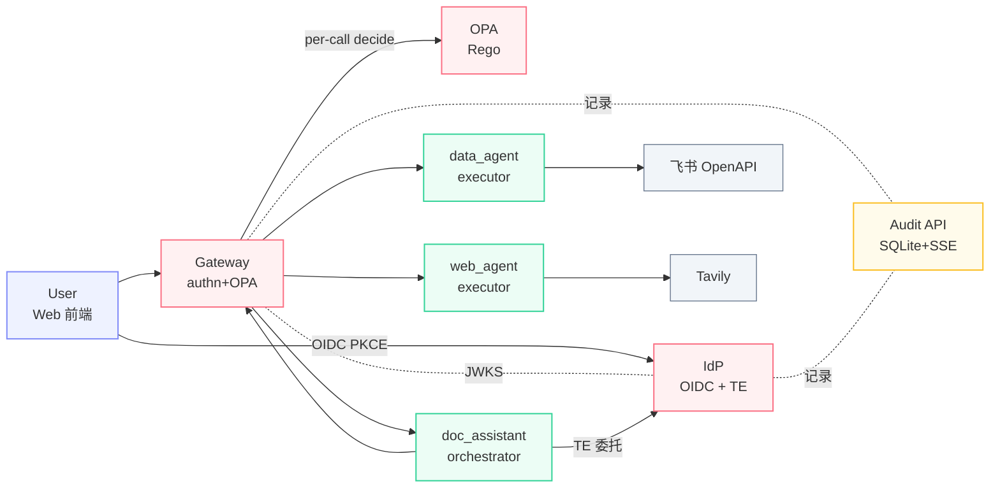
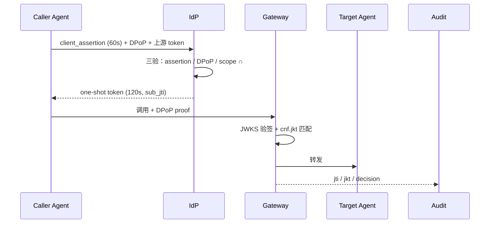

<!-- P1 · 封面 · § 一、 -->

§ 一、

# A2A-Token-System

面向多 Agent 协作的零信任授权平台

  

    
陈奕燔

    
组长 · IdP / OPA

  

  

    
周展鹏

    
Gateway / Web / Audit

  

  

    
金梓墨

    
Agents / SDK / 飞书

  

杭州电子科技大学 · 飞书 AI 校园挑战赛 决赛 2026

github.com/your-org/A2A-Token-System

<!--
开场 15s：
- 项目名 · 一句副标点出"零信任 + 多 Agent + 授权"
- 三人分工先快速亮一下
- 然后翻页进入项目结果
-->

---

<!-- P2 · 核心代码模块速览 · § 二-1-1) -->

§ 二-1-1)

# 核心代码模块速览

  
IdP

  
/token/exchange

  
三验签发委托 token · 按需最小权限

  
Gateway

  
authn_middleware

  
唯一入口 JWKS 验签 + per-call OPA 复核

  
OPA

  
agent.authz / a2a.rego

  
Rego 10 条全 AND · 决策与代码解耦

  
Audit API

  
BatchWriter

  
asyncio.Queue → SQLite 批写 + SSE 广播

  
SDK

  
client.invoke

  
屏蔽 DPoP + TE · 三框架 adapter

  
doc_assistant

  
dispatcher._topo_layers

  
LangGraph DAG 拓扑分层并发执行

  
data_agent / web_agent

  
tool dispatcher

  
飞书 OpenAPI + Tavily 检索

  
Web 前端

  
OIDC PKCE

  
RFC 7636 抗授权码截获

下一页看 7 模块如何协同 →

<!--
P2 35s：
- 横扫 7 模块，让评委建立"这是 7 个独立组件的协作"心智
- 配色：红=安全核心、橙=审计、绿=AI编排、蓝=业务Agent、紫=用户前端
- 这套配色 P3 架构图节点继承
- 结束句引向 P3
-->

---

<!-- P3 · 系统架构 · § 二-1-2) 设计 -->

§ 二-1-2)

# 系统架构

标准协议栈（OIDC + Token Exchange + DPoP）· 职责严格分离（orchestrator / executor 互斥）

<!--
P3 50s：
- 节点配色与 P2 模块卡片对齐
- 强调三条主线：用户登录、Agent 间委托（TE）、per-call 鉴权
- 引出下一页"三步走"展开数据流
-->

---

<!-- P4 · 系统功能简述 · § 二-1-2) 简述 -->

§ 二-1-2)

# 系统功能简述

  
①

  
用户登录

  

    OIDC + PKCE（RFC 7636） 
    抗授权码截获 
    一次性 code → access_token
  

  
②

  
Token Exchange

  

    RFC 8693 委托链 
    客户端 assertion + DPoP + 上游 token 
    <b>120s 一次性</b> · sub_jti 绑定
  

  
③

  
执行鉴权

  

    Gateway 验签 + per-call OPA 
    Rego 全 AND 决策 
    Audit 全程记录
  

🔒 <b>AI 链路</b>（编排 / 调用 / 输出）与 <b>安全链路</b>（IdP / GW / OPA）<b>严格隔离</b> — AI 故障不污染授权决策

<!--
P4 45s：
- 用三栏对照 P3 三条主线，落到"做什么"
- 强调 ② 的 120s 一次性是核心创新点之一
- 底部隔离提示是技术亮点 — 为 P8 铺垫
-->

---

<!-- P5 · 项目亮点 ① 协议栈 + 零信任 A2A · § 二-1-3) -->

§ 二-1-3) ①

# 亮点 ①：标准协议栈 + 零信任 A2A

  

    
RFC 7519

JWT

  

  

    
RFC 7523

Client Assertion

  

  

    
RFC 7636

PKCE

  

  

    
RFC 7638

JWK Thumbprint

  

  

    
RFC 8693

Token Exchange ★

  

  

    
RFC 9449

DPoP ★

  

  

    <b>assertion</b> 证身份
  

  

    <b>one-shot token</b> 防重放
  

  

    <b>DPoP</b> 防盗用
  

<!--
P5 55s：
- 6 RFC 不念，扫一眼即可。重点钉两颗星：8693 与 9449
- sequence 图主讲：IdP 三验 + Gateway cnf.jkt 复验
- 时序图证明：标准协议栈，复用 IETF，没有自创轮子
-->

---

<!-- P6 · 亮点 ② 最小权限 + 三道关 · § 二-1-3) -->

§ 二-1-3) ②

# 亮点 ②：最小权限 + 三道关

  
最小权限计算

  

    

      effective_scope = 
      callee_caps ∩ 
      user_perms ∩ 
      requested_scope
    

  

  

    
• <b>callee_caps</b>：被调端能力上限（注册时声明）

    
• <b>user_perms</b>：用户授权范围（OIDC consent）

    
• <b>requested_scope</b>：本次任务真正需要

  

  
三者全空 ⇒ 拒签 · 永不"宽给"

  
三道关防御

  

    

      
① IdP 签发关

      
事前 ABAC：subject / agent / action / context

    

    

      
② Gateway × OPA 关

      
per-call Rego 10 条全 AND 复核

    

    

      
③ Agent self-check 关

      
不信 Gateway · SDK 内置签名+scope 校验

    

  

<!--
P6 55s：
- 公式是"创新性"的钉子 — 三集合交集
- 三道关展示"纵深防御"，回应技术深度评分
- 注意：与 P5 是不同视觉布局（公式 vs 横向卡）避免审美疲劳
-->

---
