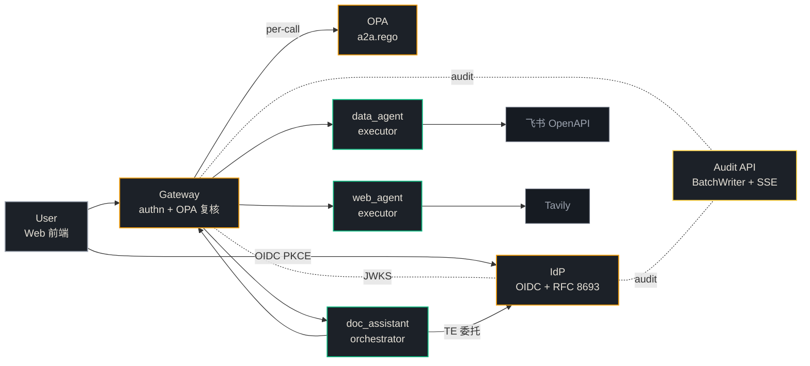
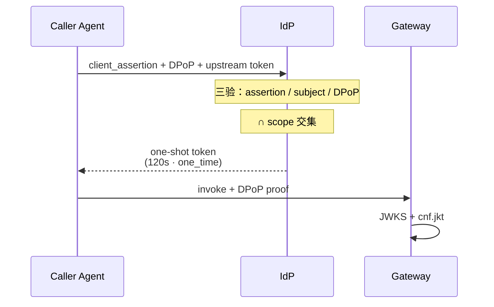

<style>
@import url('https://fonts.googleapis.com/css2?family=Fraunces:opsz,wght@9..144,300;9..144,400;9..144,500;9..144,600;9..144,700&family=IBM+Plex+Sans:wght@300;400;500;600;700&family=JetBrains+Mono:wght@400;500;700&display=swap');

:root {
  --bg: #0E1116;
  --bg-card: #161B22;
  --bg-elev: #1C2128;
  --line: #2D333B;
  --line-soft: #21262D;
  --text: #E6E1D7;
  --text-mute: #9CA3AF;
  --text-dim: #6B7280;
  --accent: #F59E0B;
  --accent-soft: #FCD34D;
  --ok: #10B981;
  --warn: #F43F5E;
}

.slidev-layout {
  background: var(--bg) !important;
  color: var(--text);
  font-family: 'IBM Plex Sans', 'Source Han Sans SC', system-ui, sans-serif;
  font-weight: 400;
  letter-spacing: -0.005em;
  padding: 2.5rem 3.5rem;
}

.slidev-layout h1,
.slidev-layout h2,
.slidev-layout h3 {
  font-family: 'Fraunces', 'Source Han Serif SC', serif;
  color: var(--text);
  font-weight: 500;
  letter-spacing: -0.02em;
  font-variation-settings: "opsz" 60;
}

.slidev-layout h1 {
  font-size: 2.4rem;
  line-height: 1.15;
  font-weight: 500;
  position: relative;
  padding-left: 0.6rem;
  border-left: 2px solid var(--accent);
  margin-bottom: 0.4rem;
}

.slidev-layout h2 {
  font-size: 1.5rem;
  font-weight: 500;
}

.slidev-layout h3 {
  font-size: 1.05rem;
  font-weight: 500;
  letter-spacing: 0;
}

.slidev-layout code {
  font-family: 'JetBrains Mono', monospace;
  background: var(--bg-elev);
  color: var(--accent-soft);
  padding: 1px 6px;
  border-radius: 3px;
  font-size: 0.85em;
  border: 1px solid var(--line-soft);
}

.slidev-layout pre, .slidev-layout pre code {
  background: var(--bg-card) !important;
  border: 1px solid var(--line);
  border-radius: 6px;
}

.slidev-layout .eyebrow {
  font-family: 'JetBrains Mono', monospace;
  font-size: 0.7rem;
  text-transform: uppercase;
  letter-spacing: 0.16em;
  color: var(--text-dim);
  margin-bottom: 0.5rem;
}

.slidev-layout .page-num {
  position: absolute;
  top: 1.6rem;
  right: 2.2rem;
  font-family: 'JetBrains Mono', monospace;
  font-size: 0.75rem;
  color: var(--text-dim);
  letter-spacing: 0.08em;
}

.slidev-layout .page-anchor {
  position: absolute;
  top: 1.6rem;
  left: 3.5rem;
  font-family: 'JetBrains Mono', monospace;
  font-size: 0.7rem;
  color: var(--text-dim);
  letter-spacing: 0.06em;
}

.slidev-layout .hr-soft {
  height: 1px;
  background: var(--line-soft);
  margin: 0.6rem 0 1.2rem 0;
}

.slidev-layout .stat {
  display: flex;
  flex-direction: column;
  gap: 0.2rem;
}

.slidev-layout .stat-num {
  font-family: 'Fraunces', serif;
  font-size: 3.2rem;
  font-weight: 400;
  font-variation-settings: "opsz" 144;
  color: var(--accent);
  line-height: 1;
  letter-spacing: -0.04em;
}

.slidev-layout .stat-label {
  font-size: 0.75rem;
  color: var(--text-mute);
  letter-spacing: 0.04em;
}

.slidev-layout .card {
  background: var(--bg-card);
  border: 1px solid var(--line);
  border-radius: 6px;
  padding: 1rem;
}

.slidev-layout .card-title {
  font-family: 'Fraunces', serif;
  font-weight: 500;
  font-size: 1rem;
  margin-bottom: 0.4rem;
}

.slidev-layout .card-mono {
  font-family: 'JetBrains Mono', monospace;
  font-size: 0.72rem;
  color: var(--text-dim);
  margin-bottom: 0.35rem;
}

.slidev-layout .card-body {
  font-size: 0.8rem;
  color: var(--text-mute);
  line-height: 1.55;
}

.slidev-layout .pill {
  display: inline-block;
  padding: 2px 8px;
  border: 1px solid var(--line);
  border-radius: 999px;
  font-family: 'JetBrains Mono', monospace;
  font-size: 0.65rem;
  letter-spacing: 0.08em;
  color: var(--text-mute);
}

.slidev-layout .pill-accent {
  border-color: var(--accent);
  color: var(--accent);
}

.slidev-layout .pill-ok { border-color: var(--ok); color: var(--ok); }
.slidev-layout .pill-warn { border-color: var(--warn); color: var(--warn); }

.slidev-layout .accent { color: var(--accent); }
.slidev-layout .ok-c { color: var(--ok); }
.slidev-layout .warn-c { color: var(--warn); }
.slidev-layout .mute { color: var(--text-mute); }
.slidev-layout .dim { color: var(--text-dim); }

.slidev-layout .toc-row {
  display: grid;
  grid-template-columns: 3rem 1fr auto;
  align-items: baseline;
  padding: 0.7rem 0;
  border-bottom: 1px solid var(--line-soft);
}

.slidev-layout .toc-num {
  font-family: 'JetBrains Mono', monospace;
  color: var(--accent);
  font-size: 0.85rem;
}

.slidev-layout .toc-title {
  font-family: 'Fraunces', serif;
  font-size: 1.05rem;
  color: var(--text);
}

.slidev-layout .toc-meta {
  font-family: 'JetBrains Mono', monospace;
  font-size: 0.7rem;
  color: var(--text-dim);
}

.slidev-layout table {
  font-size: 0.78rem;
  border-collapse: collapse;
}

.slidev-layout th, .slidev-layout td {
  border-bottom: 1px solid var(--line-soft);
  padding: 0.5rem 0.75rem;
  text-align: left;
}

.slidev-layout th {
  font-family: 'Fraunces', serif;
  font-weight: 500;
  color: var(--text);
  border-bottom-color: var(--line);
}

.slidev-layout td { color: var(--text-mute); }

.slidev-layout .mermaid {
  filter: invert(0);
}

.slidev-layout .quote {
  font-family: 'Fraunces', serif;
  font-style: italic;
  font-weight: 400;
  font-size: 1.3rem;
  color: var(--text);
  line-height: 1.45;
  border-left: 2px solid var(--accent);
  padding-left: 1rem;
}
</style>

<!-- ============================================================ -->
<!-- P1 · 封面 -->

<div class="page-num">01 / 14</div>

<div class="h-full flex flex-col justify-center">

<div class="eyebrow">飞书 AI 校园挑战赛 · 决赛 2026</div>

<h1 style="border-left: none; padding-left: 0; font-size: 3.4rem; line-height: 1.05; margin-top: 0.8rem;">
A2A-Token-<span class="accent">System</span>
</h1>

<div class="text-xl mute mt-3" style="font-family: 'Fraunces', serif; font-style: italic;">
面向多 Agent 协作的<span class="accent">零信任</span>授权平台
</div>

<div class="hr-soft mt-8" style="max-width: 32rem;"></div>

<div class="grid grid-cols-3 gap-6 mt-6 max-w-2xl text-sm">
  <div>
    <div class="dim text-xs" style="font-family: 'JetBrains Mono', monospace;">LEAD</div>
    <div style="font-family: 'Fraunces', serif; font-size: 1.1rem;">陈奕燔</div>
    <div class="mute text-xs">IdP · OPA</div>
  </div>
  <div>
    <div class="dim text-xs" style="font-family: 'JetBrains Mono', monospace;">ENGINEER</div>
    <div style="font-family: 'Fraunces', serif; font-size: 1.1rem;">周展鹏</div>
    <div class="mute text-xs">Gateway · Web · Audit</div>
  </div>
  <div>
    <div class="dim text-xs" style="font-family: 'JetBrains Mono', monospace;">ENGINEER</div>
    <div style="font-family: 'Fraunces', serif; font-size: 1.1rem;">金梓墨</div>
    <div class="mute text-xs">Agents · SDK · 飞书接入</div>
  </div>
</div>

<div class="mt-10 dim text-xs" style="font-family: 'JetBrains Mono', monospace;">
HDU · https://github.com/Woor3x/Agent-Token
</div>

</div>

<!--
P1 15s — 开场：项目名 / 副标 / 三人 / 单位 + 仓库
-->

---

<!-- ============================================================ -->
<!-- P2 · 汇报目录 -->

<div class="page-num">02 / 14</div>
<div class="page-anchor">§ AGENDA</div>

<div class="eyebrow">汇报流程</div>
<h1>从问题到答案 · 六章节</h1>
<div class="hr-soft"></div>

<div class="grid grid-cols-2 gap-x-12 mt-4">

<div>
  <div class="toc-row">
    <div class="toc-num">01</div>
    <div class="toc-title">背景 — AI Agent 时代的授权困局</div>
    <div class="toc-meta">~35s</div>
  </div>
  <div class="toc-row">
    <div class="toc-num">02</div>
    <div class="toc-title">问题分析 — OAuth 在 A2A 的失能</div>
    <div class="toc-meta">~45s</div>
  </div>
  <div class="toc-row">
    <div class="toc-num">03</div>
    <div class="toc-title">解决方案 — A2A-Token-System</div>
    <div class="toc-meta">~30s</div>
  </div>
</div>

<div>
  <div class="toc-row">
    <div class="toc-num">04</div>
    <div class="toc-title">整体设计 — 系统架构</div>
    <div class="toc-meta">~50s</div>
  </div>
  <div class="toc-row">
    <div class="toc-num">05</div>
    <div class="toc-title">模块细分 — IdP · OPA · GW · Audit · Agents</div>
    <div class="toc-meta">~190s</div>
  </div>
  <div class="toc-row">
    <div class="toc-num">06</div>
    <div class="toc-title">创新 · 对比 · 价值 · 谢幕</div>
    <div class="toc-meta">~105s</div>
  </div>
</div>

</div>

<div class="mt-6 dim text-xs" style="font-family: 'JetBrains Mono', monospace;">
TOTAL ≈ 490s · 8 min（OPA + Gateway 拆开后 +15s · 压缩 P13 谢幕缓冲）</div>

<!--
P2 15s — 目录扫一眼即过
-->

---

<!-- ============================================================ -->
<!-- P3 · 背景 -->

<div class="page-num">03 / 14</div>
<div class="page-anchor">§ 01 · BACKGROUND</div>

<div class="eyebrow">01 · 背景</div>
<h1>AI Agent 正以<span class="accent">用户身份</span>访问企业数据</h1>
<div class="hr-soft"></div>

<div class="grid grid-cols-3 gap-8 mt-8">

<div class="stat">
  <div class="stat-num">↑3×</div>
  <div class="stat-label">2024-2026 企业 Agent 部署量增速</div>
  <div class="text-xs mute mt-2">Gartner / IDC 多份报告</div>
</div>

<div class="stat">
  <div class="stat-num">A2A</div>
  <div class="stat-label">Agent-to-Agent 调用成主导模式</div>
  <div class="text-xs mute mt-2">编排者 + 多执行者拓扑普及</div>
</div>

<div class="stat">
  <div class="stat-num">∞</div>
  <div class="stat-label">委托深度 = 攻击面平方级膨胀</div>
  <div class="text-xs mute mt-2">单 Agent 失陷波及全链</div>
</div>

</div>

<div class="hr-soft mt-10"></div>

<div class="quote mt-6">
"AI Agent 需以用户身份操作企业资源 — 但 OAuth 没有为<span class="accent">机器代机器</span>的细粒度委托而设计。"
</div>

<!--
P3 35s
- 开局把"为什么这事重要"砸进评委脑子
- 三个数字是定性引子，不需精确数值
- 引语承接下一页 OAuth 失能分析
-->

---

<!-- ============================================================ -->
<!-- P4 · 问题分析 -->

<div class="page-num">04 / 14</div>
<div class="page-anchor">§ 02 · PROBLEM</div>

<div class="eyebrow">02 · 问题分析</div>
<h1>现有 OAuth 在 A2A 场景下的<span class="accent">四个失能</span></h1>
<div class="hr-soft"></div>

<div class="grid grid-cols-2 gap-5 mt-5">

<div class="card">
  <div class="card-mono">FAILURE 01 · 信任传递断裂</div>
  <div class="card-title">无机器代机器细粒度授权</div>
  <div class="card-body">OAuth access_token 只表达"用户 → 客户端"；缺失"用户 → Agent A → Agent B"链上身份与上下文，下游无法判定真实调用者。</div>
</div>

<div class="card">
  <div class="card-mono">FAILURE 02 · 时效失控</div>
  <div class="card-title">长生命期 token 与持有者凭证</div>
  <div class="card-body">小时级 access_token + Bearer 模式，一旦泄露窗口期内可重放、横向渗透；缺乏 PoP（Proof-of-Possession）绑定。</div>
</div>

<div class="card">
  <div class="card-mono">FAILURE 03 · 委托不可追</div>
  <div class="card-title">链路审计缺失</div>
  <div class="card-body">无标准化的委托链记录字段（actor / chain / trace），事后追责只能依赖应用层日志，跨 Agent 关联困难。</div>
</div>

<div class="card">
  <div class="card-mono">FAILURE 04 · 权限放大</div>
  <div class="card-title">scope 静态绑定 ≠ 任务最小</div>
  <div class="card-body">scope 在 consent 时一次绑定，无法按"本次任务实际所需"动态收敛，给出的是"上限"而非"所需"。</div>
</div>

</div>

<!--
P4 45s
- 四卡片，每卡 ~10s 念
- 这页是"评委代入痛点"的核心，不要跳
-->

---

<!-- ============================================================ -->
<!-- P5 · 解决方案 -->

<div class="page-num">05 / 14</div>
<div class="page-anchor">§ 03 · SOLUTION</div>

<div class="eyebrow">03 · 解决方案</div>
<h1>A2A-Token-System · <span class="accent">三支柱</span>回应四失能</h1>
<div class="hr-soft"></div>

<div class="quote mt-6 mb-8">
以 <span class="accent">IETF 标准协议</span> 为底座 · <span class="accent">最小权限交集</span> 为分配策略 · <span class="accent">全链审计</span> 为追责保证 — 构建<span class="accent">零信任 A2A 授权</span>平台。
</div>

<div class="grid grid-cols-3 gap-4 mt-8">

<div>
  <div class="card-mono accent">PILLAR I</div>
  <div class="card-title mt-1">标准协议栈</div>
  <div class="hr-soft" style="margin: 0.5rem 0;"></div>
  <div class="card-body">
    RFC 8693 委托链 · RFC 9449 DPoP 持有者证明 · RFC 7523 客户端断言 · RFC 7636 PKCE — 不造轮子，全栈复用。
  </div>
  <div class="mt-3 mute text-xs" style="font-family: 'JetBrains Mono', monospace;">→ 解 FAILURE 01·02</div>
</div>

<div>
  <div class="card-mono accent">PILLAR II</div>
  <div class="card-title mt-1">最小权限交集</div>
  <div class="hr-soft" style="margin: 0.5rem 0;"></div>
  <div class="card-body">
    每次签发计算 callee_caps ∩ user_perms ∩ requested_scope · 120s 一次性令牌 · 6 维即时撤销。
  </div>
  <div class="mt-3 mute text-xs" style="font-family: 'JetBrains Mono', monospace;">→ 解 FAILURE 04</div>
</div>

<div>
  <div class="card-mono accent">PILLAR III</div>
  <div class="card-title mt-1">全链审计</div>
  <div class="hr-soft" style="margin: 0.5rem 0;"></div>
  <div class="card-body">
    W3C traceparent 全链传播 · Audit 记录 decision/reasons/jti/jkt · Gateway × OPA 每调用复核。
  </div>
  <div class="mt-3 mute text-xs" style="font-family: 'JetBrains Mono', monospace;">→ 解 FAILURE 03</div>
</div>

</div>

<!--
P5 30s — 简洁三支柱，每支柱挂回失能编号，让评委感觉"问题→答案"对得上
-->

---

<!-- ============================================================ -->
<!-- P6 · 整体架构 -->

<div class="page-num">06 / 14</div>
<div class="page-anchor">§ 04 · ARCHITECTURE</div>

<div class="eyebrow">04 · 整体设计</div>
<h1>系统架构 — 安全 / 编排 / 执行 三平面</h1>
<div class="hr-soft"></div>



<div class="grid grid-cols-4 gap-3 mt-3 text-xs">
  <div><span class="pill pill-accent">SEC</span> <span class="mute ml-1">IdP · GW · OPA</span></div>
  <div><span class="pill" style="border-color: #FCD34D; color: #FCD34D;">AUDIT</span> <span class="mute ml-1">不可篡改之外，多维查询</span></div>
  <div><span class="pill pill-ok">AI</span> <span class="mute ml-1">orchestrator + executor 互斥</span></div>
  <div><span class="pill">EXT</span> <span class="mute ml-1">飞书 · Tavily</span></div>
</div>

<!--
P6 50s — 镇展示页
- 用 amber 框安全平面，绿框 AI 平面，灰框外部
- 强调三条主线：User→IdP 登录、Agent→IdP TE、Gateway→OPA 决策
-->

---

<!-- ============================================================ -->
<!-- P7 · 模块① IdP + Token Exchange -->

<div class="page-num">07 / 14</div>
<div class="page-anchor">§ 05 · MODULE I</div>

<div class="eyebrow">05.1 · 模块① · 身份与委托</div>
<h1>IdP — Token Exchange 三验签发</h1>
<div class="hr-soft"></div>

<div class="grid grid-cols-5 gap-4 mt-4">

<div class="col-span-2">



</div>

<div class="col-span-3 space-y-3">

<div>
<div class="card-mono accent">RFC 8693 · TOKEN EXCHANGE</div>
<div class="card-title">三大输入 · 三大验证</div>
<div class="card-body">
client_assertion 默认 60s（IdP 接受 ≤ 600s）<br/>
DPoP proof 防盗用 · subject token 表达原始用户身份
</div>
</div>

<div>
<div class="card-mono accent">EFFECTIVE SCOPE</div>
<div class="card-body" style="font-family: 'JetBrains Mono', monospace; font-size: 0.85rem; line-height: 1.7;">
<span style="color: var(--accent);">effective</span> = callee_caps<br/>
<span style="padding-left: 5rem;">∩ user_perms</span><br/>
<span style="padding-left: 5rem;">∩ requested_scope</span>
</div>
<div class="card-body mt-2">三集合任一为空 → 拒签。永不"宽给"。</div>
</div>

<div class="flex gap-2 mt-2">
  <span class="pill pill-accent">120s · one_time</span>
  <span class="pill">sub_jti 唯一</span>
  <span class="pill">cnf.jkt 绑定</span>
</div>

</div>

</div>

<!--
P7 45s
- 左 sequence + 右配方公式，最技术的一页
- 钉两个数字：60s / 120s + 公式
-->

---

<!-- ============================================================ -->
<!-- P8 · 模块② OPA 策略引擎 -->

<div class="page-num">08 / 14</div>
<div class="page-anchor">§ 05 · MODULE II</div>

<div class="eyebrow">05.2 · 模块② · 策略引擎</div>
<h1>OPA — <span class="accent">Policy as Code</span> 决策与代码解耦</h1>
<div class="hr-soft"></div>

<div class="grid grid-cols-5 gap-5 mt-4">

<div class="col-span-3">
  <div class="card-mono accent">REGO · 10 RULES · ALL AND</div>
  <div class="card-body mt-2" style="font-family: 'JetBrains Mono', monospace; font-size: 0.78rem; line-height: 1.85;">
    <div><span class="accent">①</span> token_valid <span class="dim">— JWT 签名/exp/aud 合法</span></div>
    <div><span class="accent">②</span> one_time_declared <span class="dim">— 必须 one_time=true</span></div>
    <div><span class="accent">③</span> audience_match <span class="dim">— aud == 被调端</span></div>
    <div><span class="accent">④</span> scope_covers <span class="dim">— 请求 ⊆ token scope</span></div>
    <div><span class="accent">⑤</span> executor_valid <span class="dim">— callee role=executor</span></div>
    <div><span class="accent">⑥</span> delegation_accepted <span class="dim">— act 链合法</span></div>
    <div><span class="accent">⑦</span> delegation_depth_ok <span class="dim">— 链深 ≤ 上限</span></div>
    <div><span class="accent">⑧</span> not_revoked <span class="dim">— 6 维撤销集均未命中</span></div>
    <div><span class="accent">⑨</span> dpop_bound <span class="dim">— cnf.jkt 与 DPoP 匹配</span></div>
    <div><span class="accent">⑩</span> context_ok <span class="dim">— time/IP/purpose 约束</span></div>
  </div>
  <div class="mt-3 dim text-xs" style="font-family: 'JetBrains Mono', monospace;">infra/opa/policies/a2a.rego · 206 行</div>
</div>

<div class="col-span-2 space-y-3">

<div class="card">
  <div class="card-mono accent">DECISION OUTPUT</div>
  <div class="card-body mt-1" style="font-family: 'JetBrains Mono', monospace; font-size: 0.72rem; line-height: 1.65;">
    {<br/>
    &nbsp;&nbsp;allow: bool,<br/>
    &nbsp;&nbsp;<span class="accent">reasons</span>: [&quot;rule_id&quot;, ...],<br/>
    &nbsp;&nbsp;jti, jkt, scope, sub<br/>
    }
  </div>
  <div class="card-body mt-2 text-xs">decision + reasons 双字段 → 拒绝即可解释</div>
</div>

<div class="card">
  <div class="card-mono accent">WHY OPA</div>
  <div class="card-body mt-1">
    业界**通用策略引擎** · 直接复用不重造 · 策略文件版本化 · 单元测试与代码解耦。
  </div>
</div>

</div>

</div>

<!--
P8 OPA 30s
- Rego 10 条逐条列，体现"策略明示"
- decision/reasons 是审计的源头
- 强调"复用 OPA 不重造"对应 P12 对比表
-->

---

<!-- ============================================================ -->
<!-- P9 · 模块② Gateway 唯一入口 -->

<div class="page-num">09 / 14</div>
<div class="page-anchor">§ 05 · MODULE II</div>

<div class="eyebrow">05.2 · 模块② · 唯一入口</div>
<h1>Gateway — <span class="accent">per-call</span> 复核 · 三道关纵深</h1>
<div class="hr-soft"></div>

<div class="grid grid-cols-2 gap-5 mt-4">

<div>
  <div class="card-mono accent">AUTHN MIDDLEWARE · 调用流水线</div>
  <div class="card-body mt-2" style="font-family: 'JetBrains Mono', monospace; font-size: 0.78rem; line-height: 1.85;">
    <div><span class="accent">①</span> JWKS 公钥验签 <span class="dim">RFC 7517</span></div>
    <div><span class="accent">②</span> DPoP proof 校验 <span class="dim">RFC 9449</span></div>
    <div><span class="accent">③</span> cnf.jkt ↔ DPoP 公钥 thumbprint</div>
    <div><span class="accent">④</span> 4 维 revocation 检查（jti/sub/agent/chain）</div>
    <div><span class="accent">⑤</span> 构造 OPA input · 调 decide</div>
    <div><span class="accent">⑥</span> allow ? 转发 : 403 + reasons</div>
    <div><span class="accent">⑦</span> 异步写 Audit（decision/jti/jkt）</div>
  </div>
  <div class="mt-3 dim text-xs" style="font-family: 'JetBrains Mono', monospace;">infra/gateway/middleware/authn.py</div>
</div>

<div class="space-y-3">

<div class="card">
  <div class="card-mono accent">GATE I · IdP 签发关</div>
  <div class="card-body mt-1">事前 ABAC：subject / agent / action / context + scope ∩ 计算。</div>
</div>

<div class="card" style="border-color: var(--accent);">
  <div class="card-mono accent">GATE II · Gateway × OPA 关</div>
  <div class="card-body mt-1">per-call JWKS + DPoP + Rego 10 条全 AND — <b>每次调用必经此关</b>。</div>
</div>

<div class="card">
  <div class="card-mono accent">GATE III · Capability 匹配关</div>
  <div class="card-body mt-1">Agent 启动期注册 + 调用前 <code>capability.find()</code> 二次校验。</div>
</div>

</div>

</div>

<div class="hr-soft mt-5"></div>

<div class="grid grid-cols-2 gap-6 mt-3 text-sm">

<div>
  <div class="card-mono accent">RFC 9449 · DPOP</div>
  <div class="card-body mt-1">每调用带 ephemeral JWS proof · 持有者证明 ↔ Bearer — token 泄露不可重放。</div>
</div>

<div>
  <div class="card-mono accent">单点收敛</div>
  <div class="card-body mt-1">Agent 仅信 Gateway · 业务无需懂 RFC · 策略变更只动 Rego。</div>
</div>

</div>

<!--
P9 Gateway 30s
- 流水线 7 步是 authn 实现
- 三道关补全：I 在 IdP / II 在 GW / III 在 Agent
- "单点收敛"对应 zero-trust 单入口理念
-->

---

<!-- ============================================================ -->
<!-- P10 · 模块③ 审计 · 撤销 · 生态 -->

<div class="page-num">10 / 14</div>
<div class="page-anchor">§ 05 · MODULE III</div>

<div class="eyebrow">05.3 · 模块③ · 可观测与生态</div>
<h1>Audit · 撤销 · 生态适配</h1>
<div class="hr-soft"></div>

<div class="grid grid-cols-2 gap-5 mt-4">

<div class="card">
  <div class="card-mono accent">6 维即时撤销 · revocation_sets</div>
  <div class="card-body mt-2">

```python
KEY_MAP = {
  "jti":   "单 token 维度",
  "sub":   "用户维度",
  "agent": "Agent 维度",
  "trace": "调用链维度",
  "plan":  "任务计划维度",
  "chain": "委托链维度",
}
# Redis Pub/Sub → 集群秒级生效
```

  </div>
</div>

<div class="card">
  <div class="card-mono accent">AUDIT · BatchWriter + SSE</div>
  <div class="card-body mt-2">
    <code>asyncio.Queue</code> → SQLite WAL 批写<br/>
    SSE 实时推送 · 多维查询<br/>
    字段：decision · reasons · jti · jkt · scope · sub<br/>
    W3C traceparent 全链 header 传播
  </div>
</div>

<div class="card">
  <div class="card-mono accent">SDK · 3 框架 ADAPTER</div>
  <div class="card-body mt-2">
    <code>agent_token_sdk/adapters/</code><br/>
    • LangChain · <code>StructuredTool</code><br/>
    • LangGraph · 节点级 invoke<br/>
    • AutoGen · 工具注入<br/>
    标准协议栈 — 任何框架可接入
  </div>
</div>

<div class="card">
  <div class="card-mono accent">TEST · 77 / 77</div>
  <div class="card-body mt-2">
    <span class="stat-num" style="font-size: 2.4rem;">77</span>
    <span class="mute"> SDK 单元 + 集成测试用例 · 100% pass</span><br/>
    覆盖 TE / DPoP / capability / adapter / fault injection
  </div>
</div>

</div>

<!--
P10 40s
- 信息密度型 2×2，每卡一条钉子
- 77 测试数字给评委"工程严谨"印象
-->

---

<!-- ============================================================ -->
<!-- P11 · 模块④ Agents 编排 + 执行 -->

<div class="page-num">11 / 14</div>
<div class="page-anchor">§ 05 · MODULE IV</div>

<div class="eyebrow">05.4 · 模块④ · Agent 编排与执行</div>
<h1>Agents — <span class="ok-c">orchestrator</span> · <span class="ok-c">executor</span> 严格分离</h1>
<div class="hr-soft"></div>

<div class="grid grid-cols-3 gap-4 mt-4">

<div class="card" style="border-color: #10B981;">
  <div class="card-mono" style="color: #10B981;">ORCHESTRATOR</div>
  <div class="card-title">doc_assistant</div>
  <div class="card-body mt-2">
    LangGraph DAG · LLM JSON mode + 规则回退<br/>
    <code>_topo_layers</code> 拓扑分层<br/>
    <code>asyncio.gather</code> 同层并发<br/>
    <code>validate_dag()</code> 失败 LLM 重试
  </div>
</div>

<div class="card">
  <div class="card-mono">EXECUTOR</div>
  <div class="card-title">data_agent</div>
  <div class="card-body mt-2">
    Intent 路由（regex 匹配）<br/>
    飞书 OpenAPI：bitable / docx / contact / calendar / drive<br/>
    Prompt Injection 清洗<br/>
    无 LLM · 纯确定性
  </div>
</div>

<div class="card">
  <div class="card-mono">EXECUTOR</div>
  <div class="card-title">web_agent</div>
  <div class="card-body mt-2">
    <code>web.search</code> · Tavily 检索<br/>
    <code>web.fetch</code> · HTML 提取 + LLM 摘要<br/>
    URL allowlist 限制<br/>
    速率限制 + 安全提取
  </div>
</div>

</div>

<div class="hr-soft mt-6"></div>

<div class="grid grid-cols-2 gap-6 mt-4 text-sm">
  <div>
    <div class="card-mono accent">SOD · SEPARATION OF DUTIES</div>
    <div class="card-body mt-1">
      <code>@field_validator("role")</code> 启动期强制 orchestrator XOR executor，互斥防越权升级。
    </div>
  </div>
  <div>
    <div class="card-mono accent">SHARED SDK</div>
    <div class="card-body mt-1">
      屏蔽 RFC 8693 TE + RFC 9449 DPoP + W3C traceparent · <code>capability.find()</code> 调用前匹配。
    </div>
  </div>
</div>

<!--
P11 45s
- 三卡 + 共享栏 = orchestrator/executor 分离落地
- 钉点：SoD 互斥 + SDK 屏蔽细节
-->

---

<!-- ============================================================ -->
<!-- P11 · AI 亮点 -->

<div class="page-num">12 / 14</div>
<div class="page-anchor">§ 06 · AI</div>

<div class="eyebrow">06 · AI 亮点</div>
<h1>AI 在产品中 · 与在开发中</h1>
<div class="hr-soft"></div>

<div class="grid grid-cols-2 gap-6 mt-4">

<div>
  <div class="card-mono ok-c">FEATURE SIDE · 产品中的 AI</div>
  <div class="space-y-2 mt-3 text-sm">

  <div class="card">
    <b>① 结构化 DAG 编排</b>
    <div class="card-body mt-1">LLM 产 JSON 计划 → <code>validate_dag()</code> 拒收非法结构 → LLM 重试 / 规则回退。</div>
  </div>

  <div class="card">
    <b>② JSON Mode + 后置 Schema</b>
    <div class="card-body mt-1"><code>response_format=json_object</code> + Schema validator 双层防线，抑制幻觉跑偏。</div>
  </div>

  <div class="card">
    <b>③ AI 与安全完全隔离</b>
    <div class="card-body mt-1">AI 路径无授权决策权 · 故障不污染 IdP/Gateway/OPA · agents 只做 capability 匹配。</div>
  </div>

  <div class="card">
    <b>④ 用户描述目标即完成</b>
    <div class="card-body mt-1"><code>_topo_layers</code> 自动拓扑分层 · 多源任务一句话搞定 — 跨飞书 + Web 一次完成。</div>
  </div>

  </div>
</div>

<div>
  <div class="card-mono accent">ENGINEERING SIDE · 开发中的 AI</div>
  <div class="space-y-2 mt-3 text-sm">

  <div class="card">
    <b>① 需求 → 方案</b>
    <div class="card-body mt-1">AI 头脑风暴备选 → 人工拍板 — brainstorming skill 落地。</div>
  </div>

  <div class="card">
    <b>② 架构 → 设计文档</b>
    <div class="card-body mt-1">AI 写 spec 作为编码"合同" · 二次审核去歧义。</div>
  </div>

  <div class="card">
    <b>③ 编码 Plan-Act</b>
    <div class="card-body mt-1">先出 plan 拆任务，再 Act 执行 · subagent-driven-development 工作流。</div>
  </div>

  <div class="card">
    <b>④ 测试与审计</b>
    <div class="card-body mt-1">AI 定位根因 → 人工确认提交 · 代码核实贯穿全程。</div>
  </div>

  </div>
</div>

</div>

<div class="hr-soft mt-4"></div>

<div class="mt-2 text-xs mute" style="font-family: 'JetBrains Mono', monospace;">
RUNTIME: Doubao Seed 2.0 Pro (agents LLM)  ·  DEV: Claude (spec / plan / code review)
</div>

<!--
P11 55s — 最重 AI 创新页
- 左 = 产品里 AI 做什么 / 右 = 开发里 AI 怎么用
- 对评委"AI 关键作用 + 工程化"问题一次答完
-->

---

<!-- ============================================================ -->
<!-- P12 · 对比 + 创新 + 价值 -->

<div class="page-num">13 / 14</div>
<div class="page-anchor">§ 06 · COMPARE</div>

<div class="eyebrow">06 · 创新 · 对比 · 价值</div>
<h1>差异化定位 — <span class="accent">五位一体</span></h1>
<div class="hr-soft"></div>

<div class="grid grid-cols-5 gap-4 mt-4">

<div class="col-span-3">

| 方案 | 定位 | 差异 |
|---|---|---|
| draft-aap-oauth-profile | IETF 组合规范 | <span class="dim">草案 · 无实现</span> |
| permit.io | 决策判定 PDP | <span class="dim">不解决 token 委托</span> |
| Okta for AI Agents | 闭源 SaaS | <span class="dim">强绑定 · 国内合规风险</span> |
| Veto | 单 Agent 策略 | <span class="dim">无 A2A 委托</span> |
| Portkey Agent Gateway | LLM 流量代理 | <span class="dim">只记录不裁决</span> |
| <span class="accent">OPA</span> | 通用策略引擎 | <span class="accent">直接复用，不重造</span> |

</div>

<div class="col-span-2 space-y-3">

<div>
  <div class="card-mono accent">FIVE PILLARS</div>
  <div class="space-y-1 mt-2 text-xs mute" style="font-family: 'JetBrains Mono', monospace;">
    <div>① 协议标准 — IETF 全栈</div>
    <div>② 零信任 — DPoP + cnf.jkt</div>
    <div>③ 最小权限 — 三集合 ∩</div>
    <div>④ 全链审计 — traceparent + 6 维撤销</div>
    <div>⑤ 多框架 — LangChain / LangGraph / AutoGen</div>
  </div>
</div>

<div class="card">
  <div class="card-mono accent">LANDING VALUE</div>
  <div class="card-body mt-1">
    解决权限失控 · 构建可信链路 · 满足合规审计 · 提升业务效率
  </div>
</div>

</div>

</div>

<!--
P12 40s
- 表 + 五支柱 + 价值合一页，避免单独价值页冗余
-->

---

<!-- ============================================================ -->
<!-- P13 · 谢幕 -->

<div class="page-num">14 / 14</div>

<div class="h-full flex flex-col justify-center">

<div class="eyebrow">END · Q&A</div>

<h1 style="font-size: 4rem; border-left: none; padding-left: 0; line-height: 1.05; font-weight: 400;">
Thank <span class="accent" style="font-style: italic;">You</span>
</h1>

<div class="text-base mute mt-4" style="font-family: 'Fraunces', serif; font-style: italic;">期待你的提问</div>

<div class="hr-soft mt-10" style="max-width: 28rem;"></div>

<div class="grid grid-cols-3 gap-6 mt-6 max-w-3xl text-sm">
  <div>
    <div class="dim text-xs" style="font-family: 'JetBrains Mono', monospace;">LEAD</div>
    <div style="font-family: 'Fraunces', serif; font-size: 1.15rem;">陈奕燔</div>
    <div class="mute text-xs">IdP · OPA · 早期 AuditApi</div>
  </div>
  <div>
    <div class="dim text-xs" style="font-family: 'JetBrains Mono', monospace;">ENGINEER</div>
    <div style="font-family: 'Fraunces', serif; font-size: 1.15rem;">周展鹏</div>
    <div class="mute text-xs">Gateway · Web · Audit 测试</div>
  </div>
  <div>
    <div class="dim text-xs" style="font-family: 'JetBrains Mono', monospace;">ENGINEER</div>
    <div style="font-family: 'Fraunces', serif; font-size: 1.15rem;">金梓墨</div>
    <div class="mute text-xs">Agents · SDK · 飞书接入</div>
  </div>
</div>

<div class="mt-10 dim text-xs" style="font-family: 'JetBrains Mono', monospace;">
https://github.com/Woor3x/Agent-Token
</div>

<div class="mt-3 text-xs mute" style="font-family: 'JetBrains Mono', monospace;">
120s 委托  ·  6 维撤销  ·  3 道关  ·  6 RFC  ·  77 SDK 测试 100% pass
</div>

</div>

<!--
P13 20s — 谢幕
- speaker notes:
  • Demo 兜底：docs/slides/public/demo-fallback.mp4 主持人按需播 30s
  • Q&A 预案：8693 vs OBO / 6 维撤销性能 / capability 防绕过 / Rego 10 条 / DPoP 实际开销
-->
