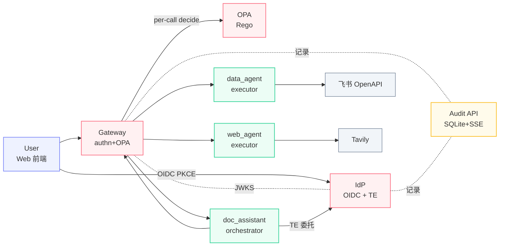

<!-- P1 · 封面 · § 一、 -->

§ 一、

# A2A-Token-System

面向多 Agent 协作的零信任授权平台

  

    
陈奕燔

    
组长 · IdP / OPA

  

  

    
周展鹏

    
Gateway / Web / Audit

  

  

    
金梓墨

    
Agents / SDK / 飞书

  

杭州电子科技大学 · 飞书 AI 校园挑战赛 决赛 2026

github.com/your-org/A2A-Token-System

<!--
开场 15s：
- 项目名 · 一句副标点出"零信任 + 多 Agent + 授权"
- 三人分工先快速亮一下
- 然后翻页进入项目结果
-->

---

<!-- P2 · 核心代码模块速览 · § 二-1-1) -->

§ 二-1-1)

# 核心代码模块速览

  
IdP

  
/token/exchange

  
三验签发委托 token · 按需最小权限

  
Gateway

  
authn_middleware

  
唯一入口 JWKS 验签 + per-call OPA 复核

  
OPA

  
agent.authz / a2a.rego

  
Rego 10 条全 AND · 决策与代码解耦

  
Audit API

  
BatchWriter

  
asyncio.Queue → SQLite 批写 + SSE 广播

  
SDK

  
client.invoke

  
屏蔽 DPoP + TE · 三框架 adapter

  
doc_assistant

  
dispatcher._topo_layers

  
LangGraph DAG 拓扑分层并发执行

  
data_agent / web_agent

  
tool dispatcher

  
飞书 OpenAPI + Tavily 检索

  
Web 前端

  
OIDC PKCE

  
RFC 7636 抗授权码截获

下一页看 7 模块如何协同 →

<!--
P2 35s：
- 横扫 7 模块，让评委建立"这是 7 个独立组件的协作"心智
- 配色：红=安全核心、橙=审计、绿=AI编排、蓝=业务Agent、紫=用户前端
- 这套配色 P3 架构图节点继承
- 结束句引向 P3
-->

---

<!-- P3 · 系统架构 · § 二-1-2) 设计 -->

§ 二-1-2)

# 系统架构

标准协议栈（OIDC + Token Exchange + DPoP）· 职责严格分离（orchestrator / executor 互斥）

<!--
P3 50s：
- 节点配色与 P2 模块卡片对齐
- 强调三条主线：用户登录、Agent 间委托（TE）、per-call 鉴权
- 引出下一页"三步走"展开数据流
-->

---
